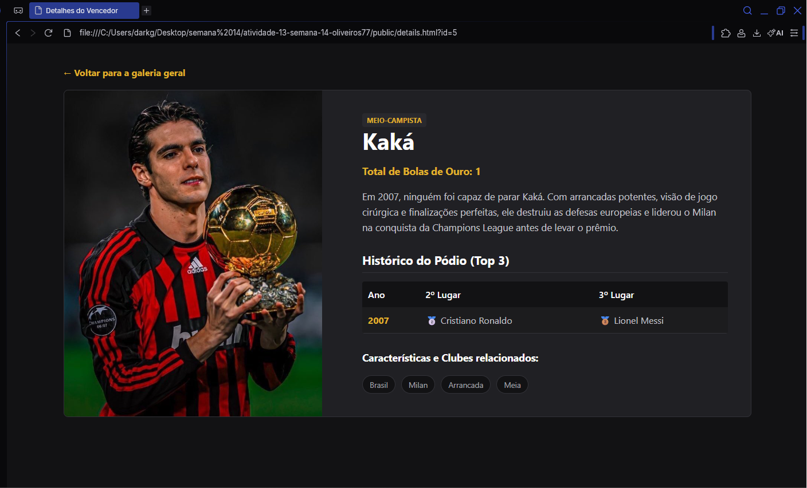
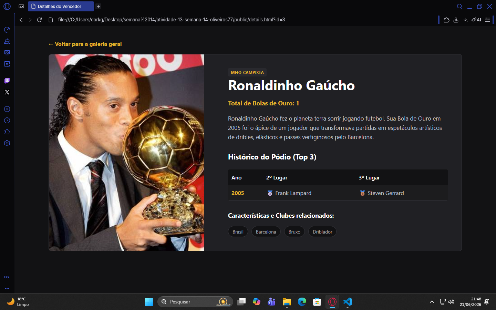
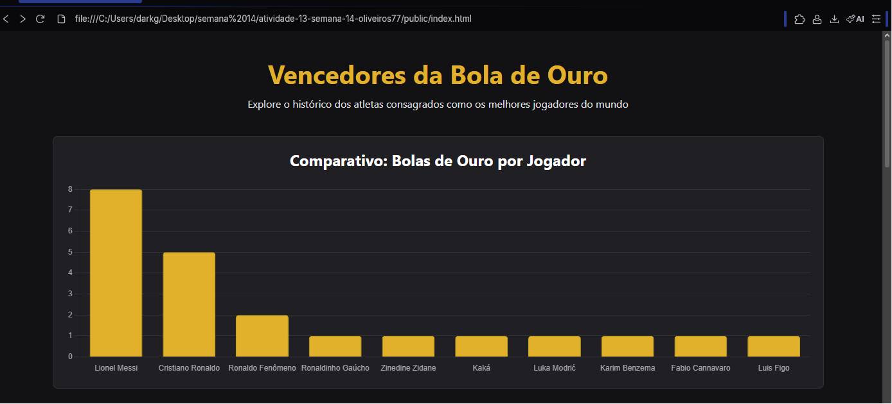

# Trabalho Prático - Semana 14

A partir dos dados disponíveis em seu projeto, vamos explorar formas de visualização que permitam apresentar essas informações de maneira clara, interativa e significativa. Você poderá utilizar gráficos (barras, linhas, pizza), mapas, calendários ou outras formas de visualização. Seu desafio é desenvolver uma página Web capaz de organizar, processar e exibir os dados de forma compreensível e visualmente atraente.

Com base no tipo de projeto escolhido, você deverá propor **visualizações que estimulem a interpretação, o agrupamento e a apresentação criativa dos dados**, trabalhando tanto os aspectos lógicos quanto os visuais da aplicação.

Sugerimos o uso das seguintes ferramentas acessíveis: [FullCalendar](https://fullcalendar.io/), [Chart.js](https://www.chartjs.org/), [Mapbox](https://docs.mapbox.com/api/), para citar algumas.

## Informações Gerais

- Nome: Oliveiros
- Matrícula: 1662959
- Proposta de projeto escolhida: Galeria 
- Breve descrição sobre seu projeto:Uma galeria interativa que lista e detalha os principais vencedores do prêmio Bola de Ouro da France Football, consumindo dados de uma API simulada com JSON Server.

**Print da tela com a implementação**

Para atender aos critérios de agrupamento e interpretação criativa de dados, integrei a biblioteca Chart.js à página inicial. A aplicação realiza um mapeamento dinâmico dos dados vindos do backend e renderiza um gráfico de barras responsivo comparando visualmente a quantidade de títulos de cada jogador, facilitando a análise estatística do usuário diretamente na interface escura da aplicação.

